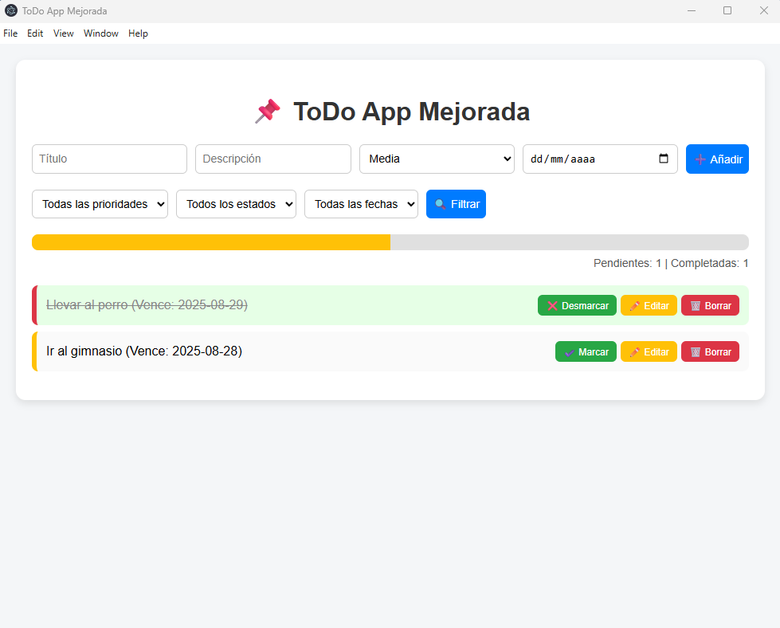
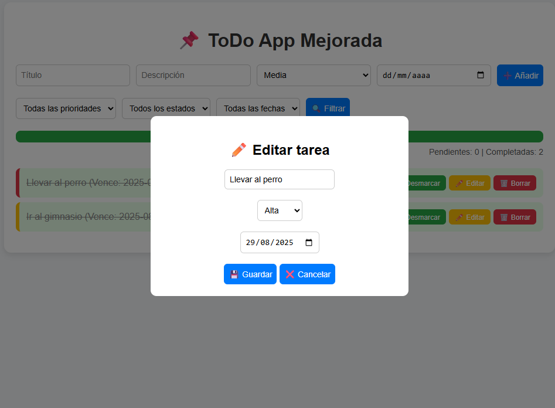

# 📝 TodoApp - Gestor de Tareas

Aplicación de gestión de tareas (**To-Do App**) construida con **Spring Boot** (backend), **HTML/CSS/JavaScript** (frontend) y empaquetada como **aplicación de escritorio con Electron**.  
Permite crear, editar, borrar y marcar tareas como completadas, además de gestionar prioridades, fechas límite y visualizar el progreso general.

---

## 🚀 Funcionalidades

✅ Crear, editar y borrar tareas.  
✅ Marcar tareas como **completadas** o **pendientes**.  
✅ Asignar **prioridad** (Baja, Media, Alta).  
✅ Definir una **fecha límite**.  
✅ Filtrar por estado (**todas, completadas, pendientes**).  
✅ Ordenar por prioridad o fecha límite.  
✅ Barra de progreso con porcentaje de tareas completadas.  
✅ Diseño responsivo y amigable.  
✅ Ejecutable multiplataforma con **Electron**.  

---

## 🖼️ Capturas de pantalla


### Lista de tareas


### Editar tarea


---

## 🛠️ Tecnologías utilizadas

- **Backend:** [Spring Boot](https://spring.io/projects/spring-boot) (Java, JPA, Hibernate, H2/MySQL).  
- **Frontend:** HTML5, CSS3, JavaScript (Vanilla).  
- **Base de datos:** H2 (en memoria) o MySQL.  
- **Desktop:** [Electron](https://www.electronjs.org/).  
- **Build Tools:** Maven, npm.  

---

## ⚙️ Instalación y ejecución

### 🔹 1. Backend (Spring Boot)
1. Clonar el repositorio:
   ```bash
   git clone https://github.com/tuusuario/todoapp.git
   cd todoapp
2. Compilar y ejecutar con Maven:
   ```bash
    mvn spring-boot:run
3. El backend quedará disponible en:
http://localhost:8080

🔹 2. Frontend (versión web)

Si deseas ejecutarlo como aplicación web independiente:

Abre src/main/resources/static/index.html en tu navegador.

Asegúrate de que el backend esté corriendo en el puerto 8080.

🔹 3. Versión Desktop (Electron)

1. Ve a la carpeta src/main/electron:
    ```bash
    cd src/main/electron
2. Instala dependencias:
    ```bash
    npm install

3. Inicia la aplicación:
    ```bash
    npm start

4. Para generar un ejecutable:
    ```bash
    npm run make


📌 Posibles mejoras futuras

 Autenticación de usuarios (login/registro).

 Notificaciones de escritorio para fechas límite.

 Vista en calendario.

 Integración con base de datos en la nube.
 
👨‍💻 Autor
@driusito

📜 Licencia
Este proyecto está bajo la licencia MIT.
